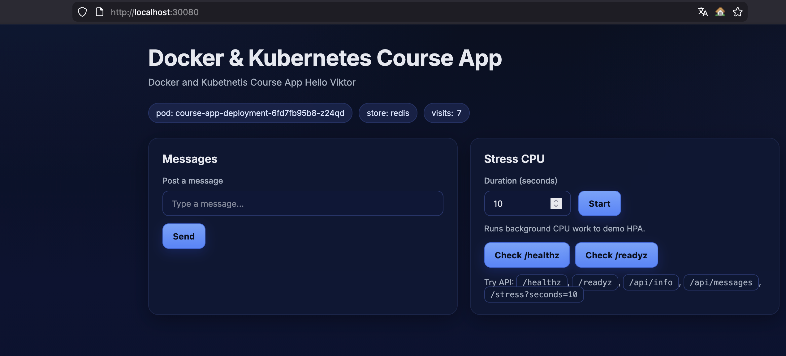

Створюємо окремий Namespace(course-app-dev):
```bash
k apply -f namespace.yml
```

Деплоїмо наші ресурси в кластер:

```bash
k apply -f .
```

Дивимось деплойменти та сервіси:

```bash
k get deployments -n course-app-dev
NAME                    READY   UP-TO-DATE   AVAILABLE   AGE
course-app-deployment   2/2     2            2           6m34s
redis-deployment        1/1     1            1           6m34s

k get svc -n course-app-dev
NAME                   TYPE        CLUSTER-IP     EXTERNAL-IP   PORT(S)          AGE
course-app-svc         NodePort    10.43.62.83    <none>        8080:30080/TCP   8m55s
redis-course-app-svc   ClusterIP   10.43.147.37   <none>        6379/TCP         8m55s
```

робимо скейл збільшуємо кількість реплік course-app до 4

```bash
k scale deploy course-app-deployment --replicas=4 -n course-app-dev 
deployment.apps/course-app-deployment scaled
k get deploy -n course-app-dev 
NAME                    READY   UP-TO-DATE   AVAILABLE   AGE
course-app-deployment   4/4     4            4           18m
redis-deployment        1/1     1            1           18m
k rollout status deploy course-app-deployment -n course-app-dev
deployment "course-app-deployment" successfully rolled out

```

Перевіряємо кількість реплік, повинно бути 4:
```bash
k get pods -n course-app-dev
NAME                                     READY   STATUS    RESTARTS   AGE
course-app-deployment-6fd7fb95b8-6cwxd   1/1     Running   0          5m17s
course-app-deployment-6fd7fb95b8-bm5ss   1/1     Running   0          23m
course-app-deployment-6fd7fb95b8-ffq9c   1/1     Running   0          23m
course-app-deployment-6fd7fb95b8-z24qd   1/1     Running   0          5m17s
redis-deployment-5b5ccc7596-j44mw        1/1     Running   0          23m
```
Перевіряємо доступність в браузері http://localhost:30080:




Видаляємо ресурси:
```bash
k delete -f .
deployment.apps "course-app-deployment" deleted from course-app-dev namespace
deployment.apps "redis-deployment" deleted from course-app-dev namespace
namespace "course-app-dev" deleted
service "course-app-svc" deleted from course-app-dev namespace
service "redis-course-app-svc" deleted from course-app-dev namespace
```