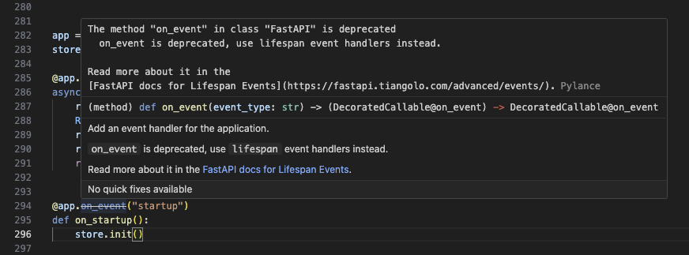
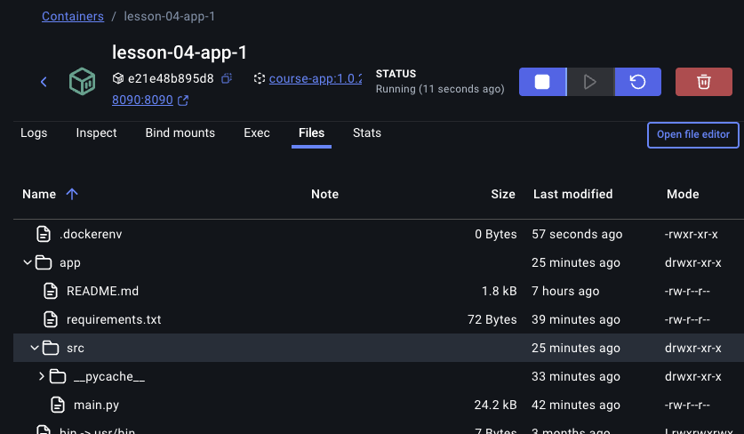
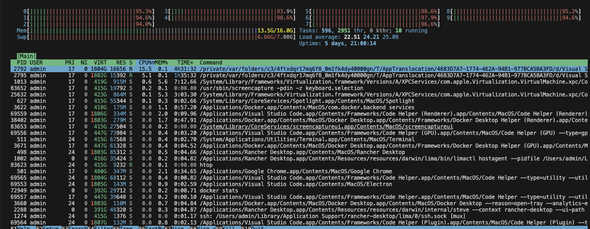
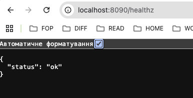
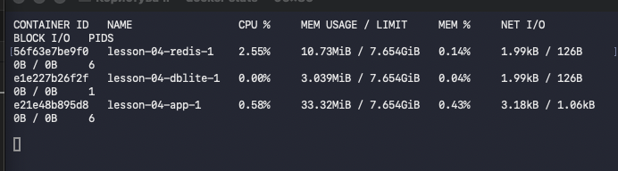

# homework-yevgeniykos-module02-lesson04

## Python 3.13.9

через помилку

Були здійснені деякі зміни в застосунку замість

`@app.on_event("startup")
 def on_startup():
     store.init()`

використав

`@asynccontextmanager
async def lifespan(app: FastAPI):
    # Code to run on startup
    print("Application startup!")
    yield
    # Code to run on shutdown
    print("Application shutdown!")`

Докер виконувався з директоріі DOCKER-AND-KUBERNETES-KLYMENOK-1
Команда білда імеджу 
`sudo docker build -t course-app:1.0.2 -f ./homeworks/yevgeniykos/module-02/lesson-04/Dockerfile .`

Stress CPU:

Команда для compose 
`docker compose -f ./homeworks/yevgeniykos/module-02/lesson-04/docker-compose.yaml up -d`

Посилання на Docker Hub 
    `docker push rdlsolutions/course-app:tagname`

